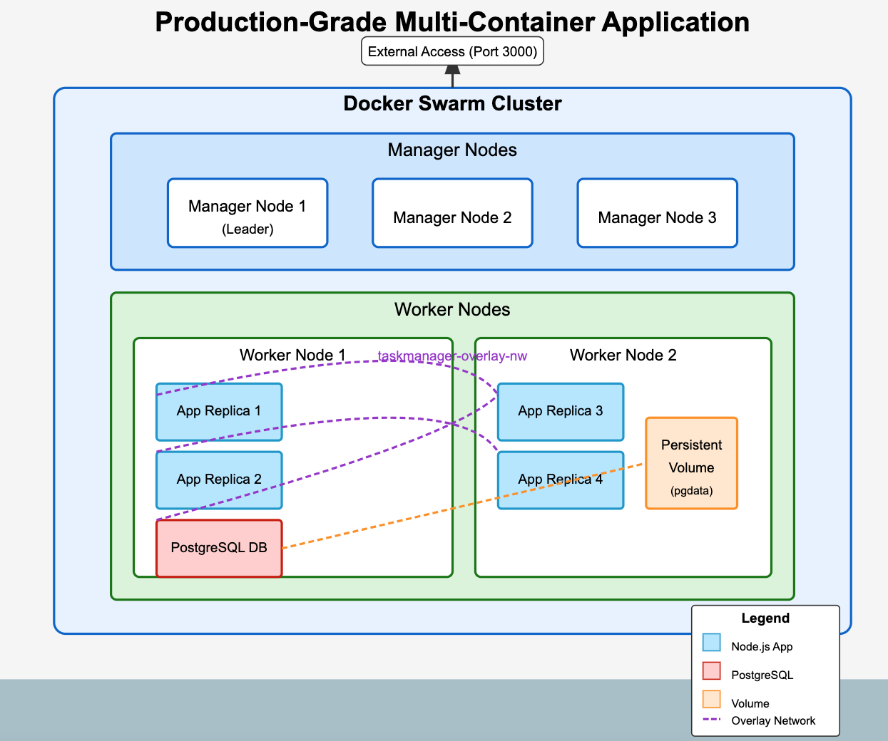

# Building a Production-Grade Application with Docker Swarm

This tutorial walks you through deploying a resilient multi-container application using Docker Swarm for orchestration.

## Architecture



Our setup includes:
- **5-node Docker Swarm cluster**: 3 managers + 2 workers
- **Task Manager Application**: 4 replicas for high availability
- **PostgreSQL Database**: With persistent storage
- **Encrypted Overlay Network**: For secure inter-service communication

## Setting Up the Swarm Cluster

### 1. Initialize the Swarm

On manager1:
```bash
docker swarm init
```

### 2. Join Manager Nodes

On manager1, get the manager join token:
```bash
docker swarm join-token manager
```

Run the provided command on manager2 and manager3:
```bash
docker swarm join --token SWMTKN-1-xxxx 192.168.65.2:2377
```

### 3. Join Worker Nodes

On any manager, get the worker join token:
```bash
docker swarm join-token worker
```

Run the provided command on worker1 and worker2:
```bash
docker swarm join --token SWMTKN-1-xxxx 192.168.65.2:2377
```

### 4. Verify Cluster Formation

```bash
docker node ls
```

## Deploying the Application

### 1. Clone the Repository

On manager1:
```bash
git clone https://github.com/EshginGuluzade/youtube.git
cd youtube/v1
```

### 2. Deploy the Stack

```bash
docker stack deploy -c docker-stack.yml taskmanager
```

### 3. Verify Services

```bash
docker service ls
docker service ps taskmanager_app
docker service ps taskmanager_db
```

## Testing the Application

Access the application through any node's IP address:
```
http://<any-swarm-node-ip>:3000
```

## Verifying Data Persistence

1. Add some tasks in the application
2. Force restart the database service:
   ```bash
   docker service update --force taskmanager_db
   ```
3. Refresh the browser - your tasks should still appear

## Performing a Rolling Update

Update to version 2.0.0 (blue to green theme):

```bash
cd ../v2
docker stack deploy -c docker-stack.yml taskmanager
```

Watch the update process:
```bash
docker service ps taskmanager_app --watch
```

Note how containers update two at a time (configured parallelism) while the application remains available.

Refresh your browser to see the new green theme, confirming the zero-downtime update!